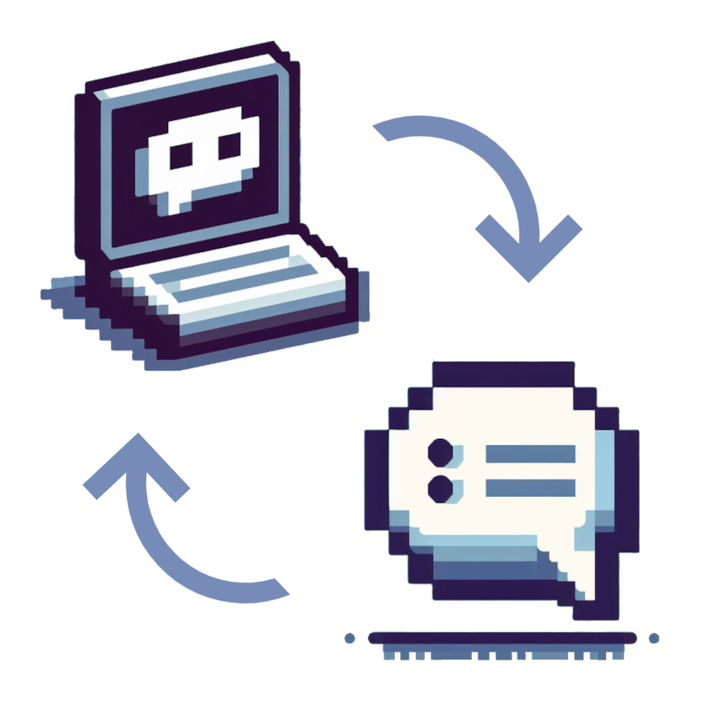

  
  <h1 align="center">WinChatTCP</h1>

# Aplicativo de chat usando Sockets TCP
Este é um aplicativo de chat simples para sistemas operacionais Windows, baseado no conceito de cliente-servidor, que permite que vários usuários se conectem a um servidor de chat e troquem mensagens em tempo real. 

## Funcionalidades
- Definir um host como servidor de chat
- Definir uma porta de sua preferência
- Conectar-se ao servidor do chat usando o IP e a porta especificada
- Enviar mensagens de texto para todos os usuários conectados
- Visualize hosts conectados e desconectados no servidor de chat

## Desenvolvimento
A aplicação foi construída na linguagem de programação C e compilada com o TDM-GCC da IDE Dev-C++, utilizando a API Win32 e a biblioteca Winsock.

## Uso
1. Compilar os arquivos `server.c` e `client.c`, de preferência usar as mesmas ferramentas que utilizei em [Desenvolvimento](#Desenvolvimento).

2. Após a compilação, inicie o executável `Server.exe` e insira uma porta de sua preferência. Feito isso, o servidor do chat estará pronto.

3. Agora que o servidor está pronto, inicie o executável `Client.exe` em qualquer host Windows da mesma rede, insira o IP do servidor e a porta que foi especificada nele (do host que está rodando o `Server.exe`) nos campos correspondentes e clique em "Connect" para conectar-se ao servidor.

4. Quando conectado ao servidor, os campos "Username" e "Message" serão liberados, sendo possível inserir um nome de usuário e o envio de mensagens de texto.

5. Todas as mensagens enviadas e recebidas aparecerão na caixa de "Chat" para todos que estão conectados na mesma rede do servidor do chat.

*Observação: todos os hosts devem estar na mesma rede local para que funcione.*
